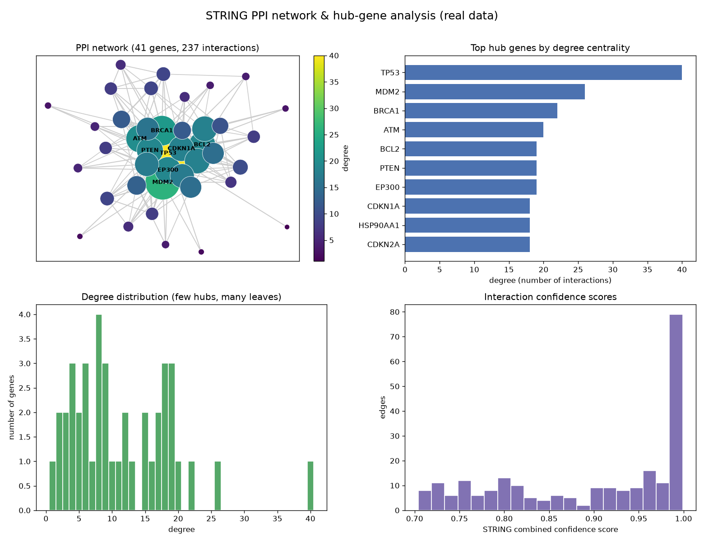

# STRING PPI Network & Hub Genes

A gene list is a bag of names. A network is a map — and the busiest intersections on that map, the **hub genes**, are usually the ones worth chasing. This project pulls a *real* protein-protein interaction network from the STRING database and ranks its hubs by degree centrality, the same idea Cytoscape's CytoHubba uses to nominate key players.

## Demo Output



`demo.py` downloads a live network from the STRING REST API (seeded on TP53). Offline, it falls back to a bundled real subset — the TP53 neighbourhood — so it always runs. Every edge is a real, scored interaction.

## Why This Exists

Genes do not act alone; they work in interacting modules, and the topology of those interactions carries biology that a ranked gene list throws away. Two facts make network analysis worth the effort. First, PPI networks are *scale-free-ish*: a few highly connected hubs hold the network together while most proteins have only a handful of partners. Second, those hubs are enriched for essential and disease-driving genes — which is exactly why, in the demo, **TP53** sits at the centre with far more connections than anything else. Degree centrality is the simplest hub metric, and often the most useful.

## How It Works

1. **Fetch a real network.** `string_utils.fetch_network` queries STRING for interactions above a confidence threshold and returns scored edges. Offline, the bundled TP53 subnetwork stands in.
2. **Rank hubs.** Degree centrality counts each gene's interactions; the top of that ranking is your hub list.
3. **Lay it out.** A from-scratch force-directed (Fruchterman-Reingold) layout — numpy only, no networkx — positions the nodes so the structure is legible, with node size and colour scaled by degree.
4. **Read the shape.** The degree distribution (many leaves, few hubs) and the edge-confidence histogram tell you whether the network is trustworthy before you interpret it.

## When NOT to Use This

Degree centrality is a starting point, not the last word. A gene can be central to a *diagram* without being biologically central — STRING mixes experimental, database, and text-mined evidence, so always look at the confidence scores and the evidence channels. For directed or causal claims you need pathway/regulatory data, not an undirected PPI graph, and betweenness or bottleneck metrics often complement degree.

## The Uncomfortable Truth

A dense hairball network looks impressive and says almost nothing. The value is never in how tangled the picture is — it is in the ranked hubs and the confidence behind each edge. If you cannot name your top hubs and defend their scores, you have drawn art, not analysis.

## Run It

```bash
pip install -r requirements.txt
python demo.py            # downloads a live STRING network (or uses the bundled subset offline)
```

`string_utils.py` provides `fetch_network`, `nodes_and_degree`, and a numpy `spring_layout` for reuse on any gene set.

## Further Reading

Data: the STRING database (https://string-db.org/). Hub-gene ranking follows the CytoHubba/Cytoscape approach widely used in network biology.

> Demonstrated on real interaction data. The demo downloads it live and ships a bundled real subset, so it is fully reproducible with or without network access.
